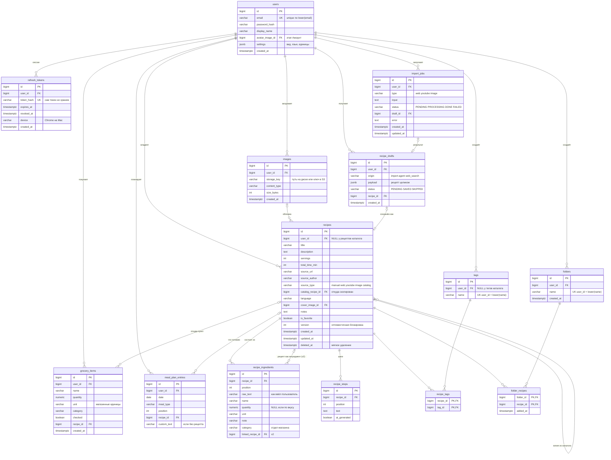

# TableTop — схема базы данных (MVP)

Версия 03.10.2026. Дополняет `mvp-spec.md` (v0.2) и `stage-2-flows.md`.

Легенда: `||--o{` — один ко многим, `}o--o{` через таблицу-связку — многие ко многим. PK — первичный ключ, FK — внешний ключ, UK — уникальный.

## Вся схема MVP

## Справочники без связей с пользователем

Общие для всех, заполняются автоматически или заранее, поэтому на схеме их нет.

| Таблица | Поля | Зачем | Этап |
|---|---|---|---|
| `product_categories` | `name_key` PK, `category` | Словарь «банан → Fruits & Vegetables» для автокатегоризации в списке покупок. Нет в словаре → спрашиваем Gemini и дописываем | 6 |
| `ingredient_substitutions_cache` | `ingredient_key` PK, `response` jsonb, `created_at` | Кеш ответов ИИ про замены, чтобы не платить за одинаковый вопрос дважды | 7 |
| `recipe_translations` | `recipe_id`, `language` (PK вместе), `payload` jsonb | Кеш перевода рецепта | после MVP |
| `flyway_schema_history` | — | Создаёт сам Flyway, руками не трогаем | 1 |

## Что когда появляется

| Этап | Таблицы |
|---|---|
| 1 (готово) | `users` |
| 2 (V2, V3) | `recipes`, `recipe_ingredients`, `recipe_steps`, `tags`, `recipe_tags`, `folders`, `folder_recipes`, `images` |
| Аккаунт | `refresh_tokens`, `users.avatar_image_id` |
| 3 | данные каталога в тех же `recipes` и `tags` с `user_id = NULL` |
| 4–5 | `import_jobs`, `recipe_drafts` |
| 6 | `grocery_items`, `meal_plan_entries`, `product_categories` |
| 7 | `ingredient_substitutions_cache` |
| v2 | `chat_sessions`, `chat_messages`, `linked_recipe_id`, таблицы Discover (ниже) |

## Чего в базе нет и почему

- **Логи и исключения.** Пишутся в стандартный вывод через SLF4J/Logback, на AWS их собирает CloudWatch. Если писать в PostgreSQL, база станет медленнее как раз в момент сбоя, а при падении базы потеряются именно те логи, которые нужны.
- **Access-токены JWT.** Не хранятся нигде на сервере: он проверяет подпись секретным ключом. Хранятся только refresh-токены, и только их хеши.
- **Глобальный справочник ингредиентов.** В рецепте ингредиент — это строка с количеством. Справочник продуктов нужен только для категорий в списке покупок (`product_categories`).

## Discover — идея на будущее (v2+)

Зафиксировано 03.10.2026, чтобы вернуться позже.

**Что не так в Honeydew**
- Блоги идут по алфавиту, найти блог, не зная названия, нельзя.
- В списке нет информации о блоге: подписчики, количество рецептов, рейтинг, когда последний раз обновлялся. Видно только после захода в блог или подписки.
- Вкладка открывает последний блог, на который подписались. Это не мешает.

**Чего хотим**
- Карточка блога в списке: подписчики, число рецептов, средний рейтинг, дата последнего обновления.
- Поиск блогов по смыслу (кухня, тема, рецепты внутри), а не только по точному названию.
- Сортировка и фильтры: популярность, посещаемость, частота обновлений, общие подписки с друзьями.
- Ощущение соцсети: подписки, лента обновлений, рекомендации.

**Таблицы, которые для этого понадобятся (черновик)**
- `blogs` (id, owner_user_id или внешний источник, name, description, avatar, created_at)
- `blog_follows` (follower_user_id, blog_id, created_at)
- `recipes.visibility` (private / public) и `recipes.blog_id`
- `recipe_ratings` (user_id, recipe_id, stars, created_at)
- `blog_stats` (blog_id, followers_count, recipes_count, avg_rating, last_post_at, views_7d) — пересчитывается по расписанию, чтобы сортировка по популярности не считала всё на лету
